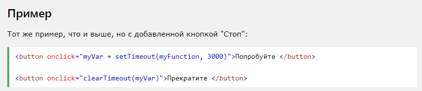
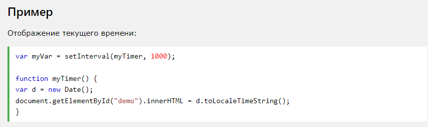
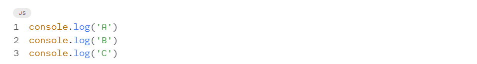
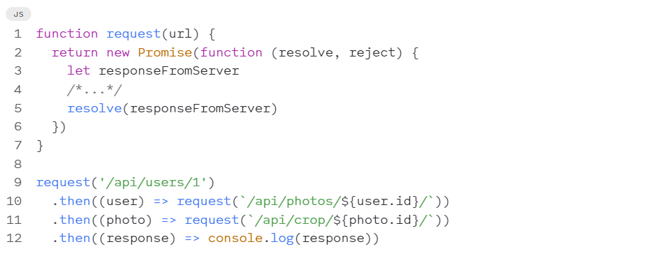
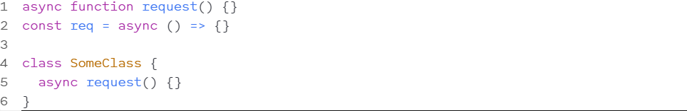
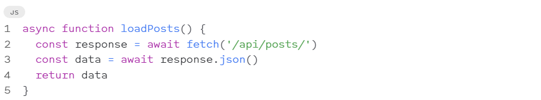
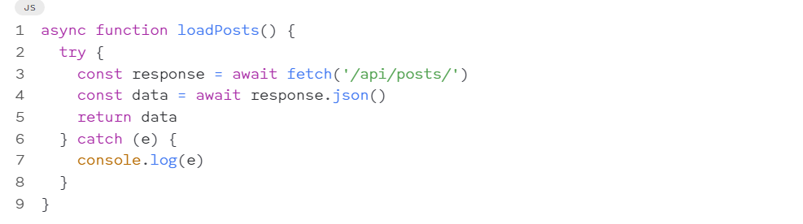

# lactuere7async-await

# JavaScript Синхронизация событий

# Время событий
Объект window позволяет выполнение кода через определенные промежутки времени.
Эти временные интервалы называются временными событиями.

Два ключевых метода для использования с JavaScript:
setTimeout(function, milliseconds)
Выполняет функцию после ожидания указанного количества миллисекунд.

setInterval(function, milliseconds)
То же, что и setTimeout(), но постоянно повторяет выполнение функции.

# Метод setTimeout()
window.setTimeout(function, milliseconds);
Метод window.setTimeout() может быть записан без префикса window.

Первый параметр - это функция, которую нужно выполнить.

Второй параметр указывает количество миллисекунд до выполнения.

# Как остановить исполнение?
Метод clearTimeout() останавливает выполнение функции, указанной в SetTimeout().

window.clearTimeout(timeoutVariable)
Метод window.clearTimeout() может быть записан без префикса window.

Метод clearTimeout() использует переменный возвращаемые setTimeout():

myVar = setTimeout(function, milliseconds);
clearTimeout(myVar);
Если функция еще не была выполнена, вы можете остановить выполнение, вызвав clearTimeout() метод:

# Метод setInterval()
Метод setInterval() повторяет заданную функцию в каждый данный интервал времени.

window.setInterval(function, milliseconds);
Метод window.setInterval() может быть записан без префикса window.

Первый параметр - это функция, которую нужно выполнить.

Второй параметр указывает длину интервала времени между каждым выполнением.

В этом примере один раз в секунду выполняется функция "myTimer" (как в цифровых часах).

# Асинхронность в JS
Как устроена асинхронность: что такое Event loop и очередь событий, при чём здесь Web API, и как работают промисы и async/await

# Кратко
Чтобы понять, что такое асинхронность, сперва поговорим о синхронном коде и том, как в принципе JavaScript выполняет код.

Чтобы выполнить код, нам нужен JavaScript Engine (движок) — программа, которая «читает и выполняет» то, что мы написали. Самый распространённый движок среди всех — это V8, он используется в Google Chrome и Node.js.

Выполнение JS-кода — однопоточное. Это значит, что в конкретный момент времени движок может выполнять не более одной строки кода. То есть вторая строка не будет выполнена, пока не выполнится первая.

Такое выполнение кода (строка за строкой) называется синхронным.

# Выведется:

A
B
C

# Асинхронный код
Теперь попробуем решить эту же задачу, но так, чтобы наш код не блокировал выполнение. Для этого мы воспользуемся функцией setTimeout():

# Промисы (Promise) 
Промис — это объект-обёртка для асинхронного кода. Он содержит в себе состояние: вначале pending («ожидание»), затем — одно из: fulfilled («выполнено успешно») или rejected («выполнено с ошибкой»).

В понятиях цикла событий промис работает так же, как колбэк: функция, которая должна выполниться (resolve или reject), находится в окружении Web API, а при наступлении события — попадает в очередь задач, откуда потом — в стек вызова.

В асинхронных задачах есть разделение между макрозадачами и микрозадачами. Колбэки в промисах попадают в очередь микрозадач, тогда как колбэк в setTimeout() — в очередь макрозадач. Но здесь и сейчас мы в такие детали уходить не будем.

Промисы придумали, чтобы организовывать асинхронный код последовательно.

Та же последовательность запросов из прошлого примера, но переписанная с использованием промисов.

# Асинхронные функции 
Если коротко, асинхронные функции — функции, которые возвращают промисы.

Асинхронная функция помечается специальным ключевым словом async:

# Связка async/await 
Внутри асинхронных функций можно вызывать другие асинхронные функции, без каких-либо then() или колбэков, с помощью ключевого слова await.

В примере выше мы используем метод fetch() внутри функции loadPosts().

Все асинхронные функции внутри мы вызываем с await — таким образом промис, который функция возвращает, автоматически разворачивается, и мы получаем значение, которое внутри промиса было.

# Плюсы async/await
Код чище и короче. У нас больше нет цепочек из then(), вместо этого мы получаем плоскую структуру, которая по виду похожа на синхронный код.

Условия и вложенные конструкции становятся чище и проще читаются.

Мы можем обрабатывать ошибки с try-catch. Как и с синхронным кодом, обработка ошибок сводится к оборачиванию опасных операций в try-catch:

